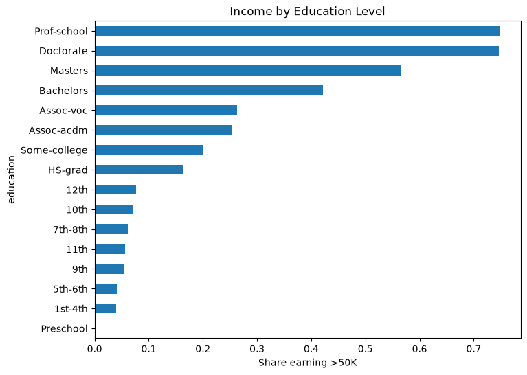

[](https://github.com/agastyavinchhi/Adult-Income-Analysis/actions/workflows/python-app.yml)

# Adult Income

Predicting whether someone earns more than $50K a year using the [Adult Census Income](https://archive.ics.uci.edu/dataset/2/adult) dataset.

The point of this project was to take a messy real-world dataset from start to finish: clean it up, use some plots to figure out which features actually carry signal, train a model on them, and then check whether the features the model leans on line up with what the plots suggested.

Why is refactoring good?

Refactor today, otherwise you will end up having to refactor tomorrow!

## Files

```
main.py                     # the pipeline: load -> preprocess -> train -> evaluate
tests/                      # pytest unit and system tests
.github/workflows/          # GitHub Actions CI config
adult.csv                   # the dataset
images/                     # exported plots
pyproject.toml              # dependencies and pytest config
uv.lock                     # pinned versions for reproducible installs
```

## Dataset

About 32.5K rows of 1994 US census data. Each row is a person with 14 features and a target column, `income`, which is either `<=50K` or `>50K`.

Six of the features are numeric — `age`, `fnlwgt`, `education.num`, `capital.gain`, `capital.loss`, and `hours.per.week` — and the other eight are text categories: `workclass`, `education`, `marital.status`, `occupation`, `relationship`, `race`, `sex`, and `native.country`.

## What I did

Everything — cleaning, exploration, training, and evaluation — lives in `main.py`.

Started by loading the CSV and running `head()`, `describe()`, and `info()` to understand the columns and types. Missing values are stored as `"?"` rather than as actual nulls, so Pandas doesn't flag them — I replaced them first, which showed the gaps were concentrated in `workclass` (1,836), `occupation` (1,843), and `native.country` (583). Dropping those rows along with 24 duplicates left 30,139 clean rows.

Education turned out to be one of the clearest signals separating the two income groups — Prof-school and Doctorate holders earn >50K about 75% of the time, versus 42% for Bachelors and 16% for HS-grad. That's what `plot_income_by_education()` in `main.py` produces:

[](images/income_by_education.png)

## The model

The plots made it clear the features had signal, so I used all 14 of them. The numeric columns go in as they are, and the categorical ones get one-hot encoded with `pd.get_dummies()` so each category becomes its own binary column. I converted `income` into a binary `high_income` target, split the data 80/20, and trained a `GradientBoostingClassifier` on defaults with `random_state=42`. The model achieved **86.5% accuracy** on the test set.

Here's what it ended up relying on:

| Feature | Importance |
|---|---|
| `marital.status_Married-civ-spouse` | 0.39 |
| `education.num` | 0.20 |
| `capital.gain` | 0.19 |
| `capital.loss` | 0.06 |
| `age` | 0.06 |
| `hours.per.week` | 0.04 |

Those six account for almost all of it. Occupation shows up further down, but split across individual job categories, so no single one contributes much — `Exec-managerial` is the largest at 0.016. Education, age, and hours all matching what I saw in the plots was a good sanity check.

## Testing & CI

Tests live in `tests/test_main.py` and cover the core pipeline:

- **Data loading** — the CSV loads without errors
- **Preprocessing** — `"?"` values and duplicate rows are correctly dropped
- **Feature computation** — the income-share-by-education aggregation used in the plot produces correct values
- **Full pipeline (system test)** — load → preprocess → train runs end-to-end and produces a valid model and accuracy

A GitHub Actions workflow (`.github/workflows/python-app.yml`) runs the full test suite with `uv run pytest` on every push and pull request to `main`.

## Running it

Dependencies are managed with `uv`. `pyproject.toml` lists what the project needs and `uv.lock` pins the exact versions, so every install is identical.

```bash
make install    # create .venv and install everything from uv.lock
make run        # run the pipeline (python main.py) and print test accuracy
make test       # run the unit and system tests with pytest (-v for verbose output)
make clean      # remove checkpoints and caches
```
