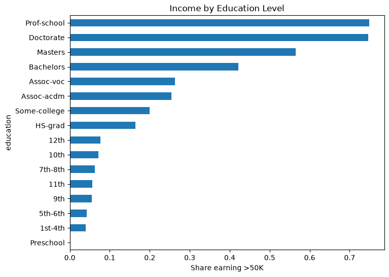
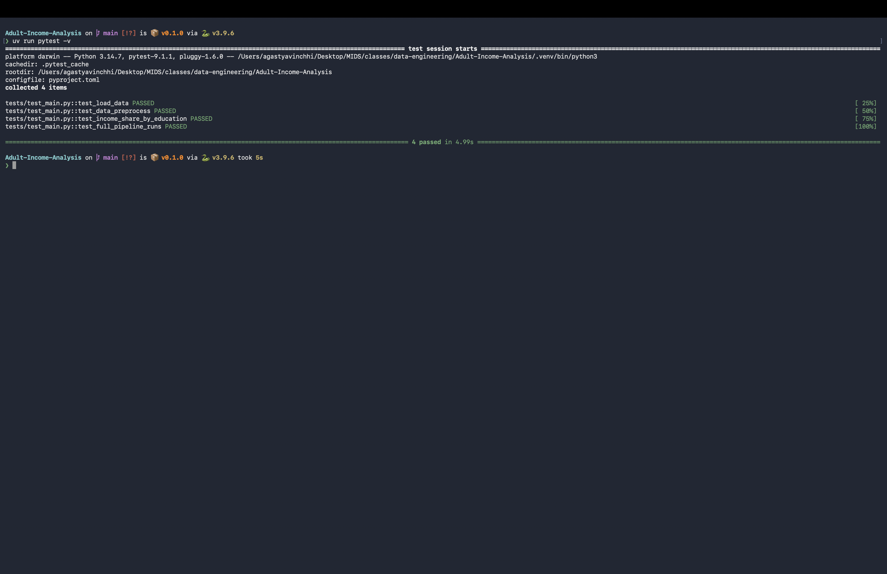
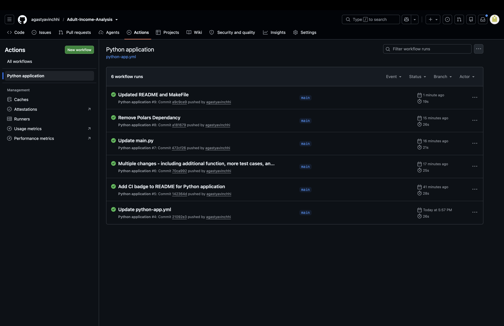
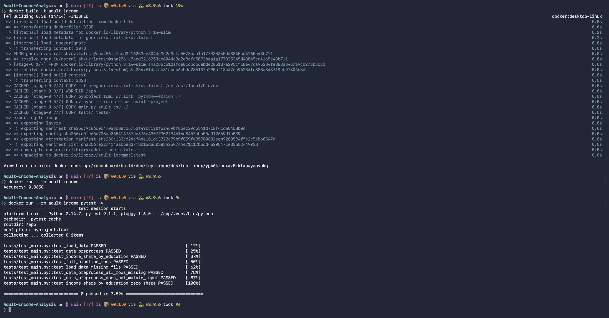
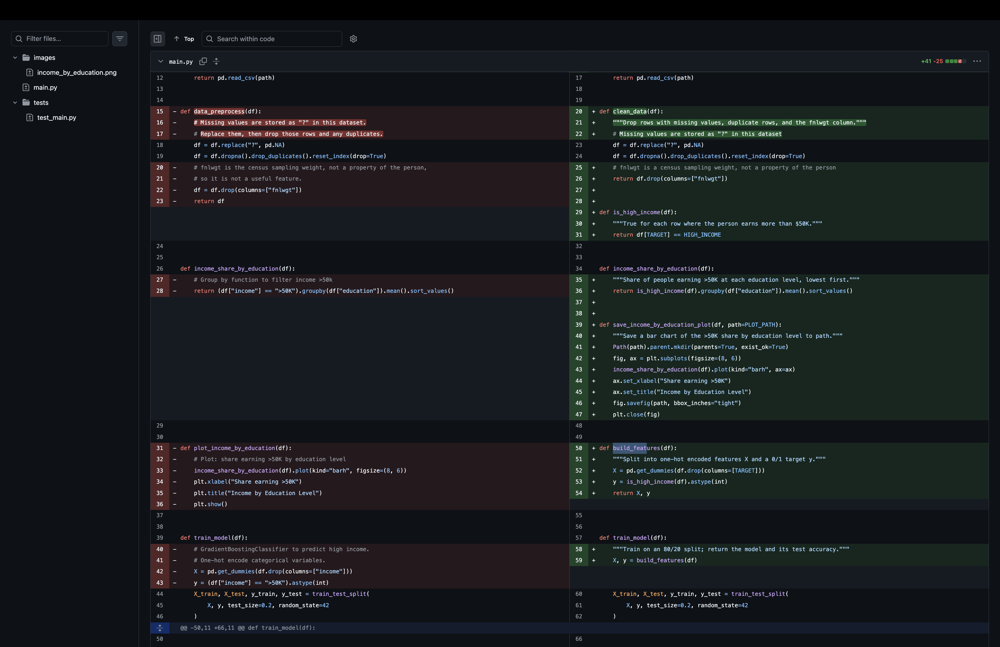

[](https://github.com/agastyavinchhi/Adult-Income-Analysis/actions/workflows/python-app.yml)

# Adult Income

Predicting whether someone earns more than $50K a year using the [Adult Census Income](https://archive.ics.uci.edu/dataset/2/adult) dataset.

The point of this project was to take a messy real-world dataset from start to finish: clean it up, use some plots to figure out which features actually carry signal, train a model on them, and then check whether the features the model leans on line up with what the plots suggested.

Why is refactoring good?

Refactor today, otherwise you will end up having to refactor tomorrow!

## Files

```
main.py                     # the pipeline: load -> preprocess -> train -> evaluate
tests/                      # pytest unit and system tests
.github/workflows/          # GitHub Actions CI config
adult.csv                   # the dataset
images/                     # exported plots
pyproject.toml              # dependencies and pytest config
uv.lock                     # pinned versions for reproducible installs
```

## Dataset

About 32.5K rows of 1994 US census data. Each row is a person with 14 features and a target column, `income`, which is either `<=50K` or `>50K`.

Six of the features are numeric — `age`, `fnlwgt`, `education.num`, `capital.gain`, `capital.loss`, and `hours.per.week` — and the other eight are text categories: `workclass`, `education`, `marital.status`, `occupation`, `relationship`, `race`, `sex`, and `native.country`.

## What I did

Everything (cleaning, exploration, training, and evaluation) lives in `main.py`.

Missing values are stored as `"?"` rather than as actual nulls, so Pandas doesn't flag them — `data_preprocess()` replaces them first, which surfaces the gaps concentrated in `workclass` (1,836), `occupation` (1,843), and `native.country` (583). Dropping those rows along with 23 duplicates and the `fnlwgt` column (a census sampling weight, not a property of the person) leaves 30,139 clean rows.

Education turned out to be one of the clearest signals separating the two income groups — Prof-school and Doctorate holders earn >50K about 75% of the time, versus 42% for Bachelors and 16% for HS-grad. That's what `plot_income_by_education()` in `main.py` produces:

[](images/income_by_education.png)

## The model

The plot made it clear education carries signal, so `train_model()` uses all 14 remaining features. The numeric columns go in as they are, and the categorical ones get one-hot encoded with `pd.get_dummies()`. `income` becomes a binary target (1 if `>50K`, else 0), split 80/20, and a `GradientBoostingClassifier` trains on defaults with `random_state=42`. The model gets **86.6% accuracy** on the test set.

Here's what it ended up relying on:

| Feature | Importance |
|---|---|
| `marital.status_Married-civ-spouse` | 0.39 |
| `education.num` | 0.20 |
| `capital.gain` | 0.19 |
| `capital.loss` | 0.06 |
| `age` | 0.06 |
| `hours.per.week` | 0.04 |

Those six account for almost all of it. Occupation shows up further down, but split across individual job categories, so no single one contributes much — `Exec-managerial` is the largest at 0.016.

## Testing & CI

Tests live in `tests/test_main.py` and cover the core pipeline:

- **Data loading** — the CSV loads without errors
- **Preprocessing** — `"?"` values and duplicate rows are correctly dropped
- **Feature computation** — the income-share-by-education aggregation used in the plot produces correct values
- **Full pipeline (system test)** — load → preprocess → train runs end-to-end and produces a valid model and accuracy

A GitHub Actions workflow (`.github/workflows/python-app.yml`) runs the full test suite with `uv run pytest` on every push and pull request to `main`.

All tests passing locally:

[](images/screenshot-2.png)

All tests passing in CI:

[](images/screenshot-1.png)

## Running it

Dependencies are managed with `uv`. `pyproject.toml` lists what the project needs and `uv.lock` pins the exact versions, so every install is identical.

```bash
make install    # create .venv and install everything from uv.lock
make run        # run the pipeline (python main.py) and print test accuracy
make test       # run the unit and system tests with pytest (-v for verbose output)
make clean      # remove checkpoints and caches
```

The image starts from `python:3.14-slim`, copies in `uv`, and installs dependencies from `uv.lock` with `--frozen`, so the container gets exactly the same versions as local development. Dependencies are copied and installed before the code, which means rebuilding after a code change reuses the cached install layer and takes seconds instead of minutes.

## Final Submission Remarks

Changes made for this submission:

* **CI:** Confirmed the GitHub Actions workflow runs successfully and added a working status badge to the top of this README.
* **Workflow upgrades:** Updated `.github/workflows/python-app.yml` with:
  * a **matrix strategy** that tests on Python 3.12, 3.13 and 3.14
  * a **scheduled run** every Monday, to catch breakage from new dependency releases
  * a **formatting check** (`black --check`) and **linting** (`flake8`) before the tests
  * an upgrade to `setup-uv@v6`, so each matrix job installs its own Python version
* **Tests:** Grew the suite from 4 to 10 tests, adding edge cases: a missing file, all rows missing values, the input DataFrame not being modified, an education level with zero high earners, and the plot folder not existing yet.
* **Docker:** Added a `Dockerfile` and `.dockerignore` so the pipeline and tests run in an identical container anywhere (details below).
* **Refactoring:** Restructured `main.py` for readability and testability, and added `make format` and `make lint` to the Makefile (details below).
* **Polish:** The pipeline now saves the education plot to `images/` automatically on every run and prints the model's test accuracy. Features are built in a separate, tested step that guarantees the target never leaks into the model's inputs. Missing values and top-coded outliers are documented in the data cleaning section.

### Docker

**How to build and run:**

1. Install [Docker Desktop](https://www.docker.com/products/docker-desktop/) and open it. The engine must be running; check with `docker info`.
2. Build the image from the project root:
   ```bash
   docker build -t adult-income .
   ```
3. Run the pipeline. It prints the model accuracy:
   ```bash
   docker run --rm adult-income
   ```
4. Run the test suite inside the container:
   ```bash
   docker run --rm adult-income pytest -v
   ```
5. Optional: copy the generated plot back to your machine by mounting the `images/` folder:
   ```bash
   docker run --rm -v "$PWD/images:/app/images" adult-income
   ```
6. List your images and containers:
   ```bash
   docker images
   docker ps -a
   ```

**What I learned:**
- I learnt how to use docker succesfuly and setup the relevant files for it such as `Dockerfile` and `.dockerignore`.
- A container has no screen, so `plt.show()` does nothing there. That's part of why the refactor switched to saving the plot to a file.
- Files written inside a container disappear when it exits unless you mount a folder, for example `docker run --rm -v "$PWD/images:/app/images" adult-income`.
- The Docker engine has to be running (Docker Desktop open) before any `docker` command works.

Build, run, and all tests passing inside the container:



### Refactoring

**What I changed, and why:**

| Change | Why |
|---|---|
| Renamed `data_preprocess` → `clean_data` (F2 in VS Code) | "Preprocess" was vague. The new name says what the function does. |
| Extracted `build_features()` from `train_model()` | `train_model` was doing two jobs. Splitting them made feature building testable on its own, which led to the new target-leakage test. |
| Added `is_high_income()` and the constants `TARGET` and `HIGH_INCOME` | `df["income"] == ">50K"` was duplicated in several places, so a typo in one copy would have silently broken results. |
| Replaced `plot_income_by_education()` + `plt.show()` + the `SHOW_PLOT` flag with `save_income_by_education_plot()` | `plt.show()` does nothing in Docker or CI. Saving to a file makes the chart reproducible on every run. |
| Replaced comments with docstrings | Each function now says what it returns. |
| Formatted with `black`, linted with `flake8`, and added both to the Makefile and CI | This keeps the style consistent and catches errors before the tests run. |

**How I verified it:**
- All tests still pass, and I added 2 new ones for the extracted functions.
- `make run` prints exactly the same **0.8658 accuracy** before and after the refactor, so behaviour is unchanged.
- flake8 caught 4 calls the F2 rename missed in the test file (`F821 undefined name`) before the tests ever ran.

Before and after, from the refactor commit's split diff on GitHub:


